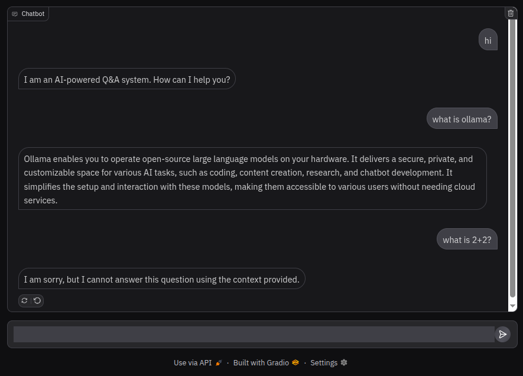

# document-chatbot
a question-answering chatbot using mxbai-embed-large for embeddings and an LLM with Retrieval-Augmented Generation (RAG). built with gradio, it answers only questions relevant to the provided document

## setup:
```bash
pip install -r requirements.txt
```
```bash
export GOOGLE_API_KEY=<api_key>
```
```bash
ollama pull mxbai-embed-large
```
```bash
python document_qa.py
```

## preview:


